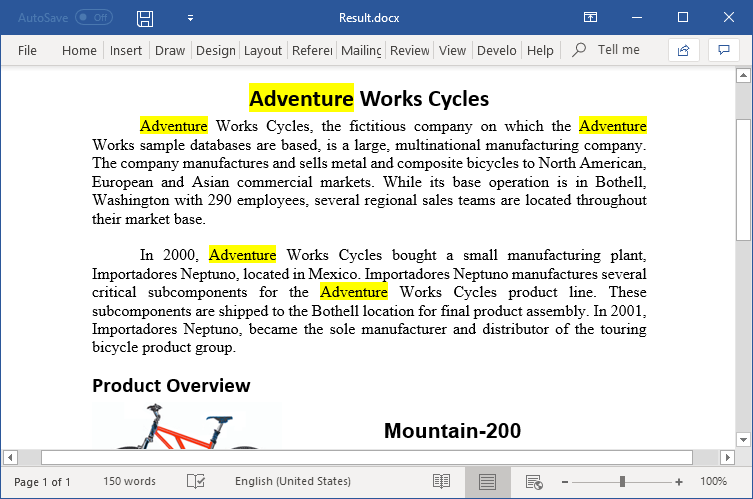
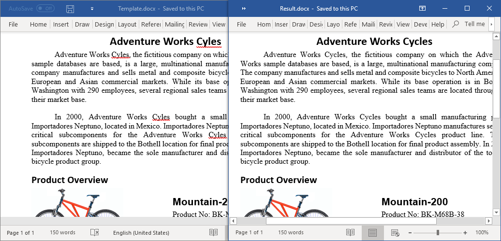
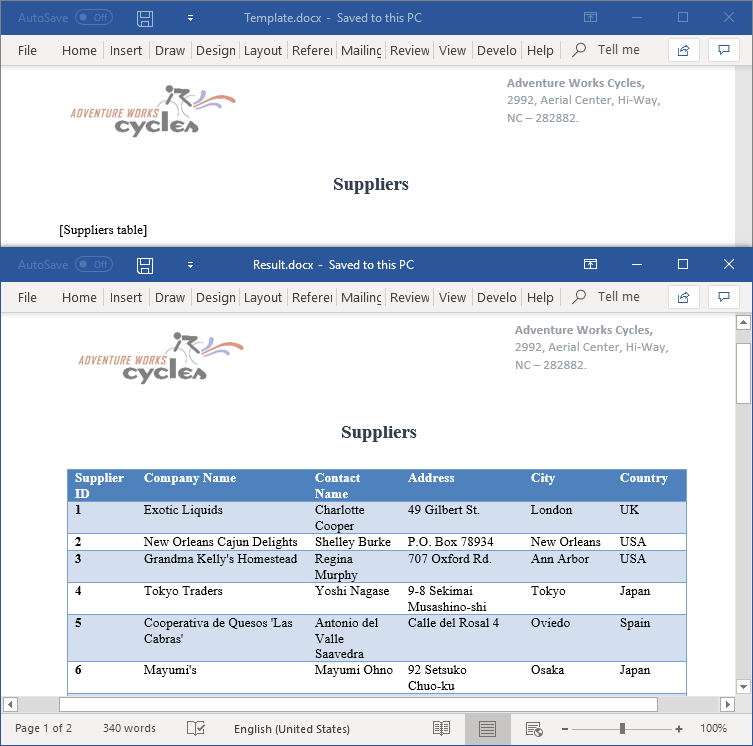

# Word Find and Replace examples

This repository contains examples that illustrates how to find and replace text in Word documents programmatically in C# and VB.NET using Syncfusion&reg; [.NET Word library](https://www.syncfusion.com/document-processing/word-framework/net/word-library?utm_source=github&utm_source=github&utm_medium=listing&utm_campaign=github-docio-examples) (DocIO) without Microsoft Word or Office interop dependencies.

## Find and replace text in Word documents using C#
The Syncfusion&reg; [.NET Word library](https://www.syncfusion.com/document-processing/word-framework/net/word-library?utm_source=github&utm_source=github&utm_medium=listing&utm_campaign=github-docio-examples) (DocIO) provides comprehensive APIs to find and replace text in a Word document with any desired text, image, hyperlink, paragraph, table, and part of a document or an entire document. It provides options to find text by matching case and whole words. You can find each occurrence one by one or all the occurrences of a text in the document. It saves your efforts and time by helping you to automate find and replace a pattern of text in a Word document using [Regex](https://docs.microsoft.com/en-us/dotnet/api/system.text.regularexpressions.regex?utm_source=github&utm_source=github&utm_medium=listing&utm_campaign=github-docio-examples). It allows you to save the resultant document as Word document (DOCX, WordML), PDF, image, HTML and more.

## Key Features

- [Find and highlight text in C#](https://help.syncfusion.com/file-formats/docio/working-with-find-and-replace?utm_source=github&utm_source=github&utm_medium=listing&utm_campaign=github-docio-examples#find-text-in-a-word-document-and-format) - Find text from a Word document and format or highlight it.
- [Find and replace text in C#](https://help.syncfusion.com/file-formats/docio/working-with-find-and-replace?utm_source=github&utm_source=github&utm_medium=listing&utm_campaign=github-docio-examples#find-and-replace-text-with-other-text) - Find text from a Word document and replace it with another text.
- [Replace text with image in C#](https://help.syncfusion.com/file-formats/docio/working-with-find-and-replace?utm_source=github&utm_source=github&utm_medium=listing&utm_campaign=github-docio-examples#find-and-replace-text-with-an-image) - Find a placeholder text from a Word document and replace it with any desired image.
- [Replace text with merge field in C#](https://help.syncfusion.com/file-formats/docio/working-with-find-and-replace?utm_source=github&utm_source=github&utm_medium=listing&utm_campaign=github-docio-examples#find-and-replace-a-pattern-of-text-with-a-merge-field) - Find a pattern of text from a Word document and replace it with merge fields.
- [Replace text with table in C#](https://help.syncfusion.com/file-formats/docio/working-with-find-and-replace?utm_source=github&utm_source=github&utm_medium=listing&utm_campaign=github-docio-examples#find-and-replace-text-with-a-table) - Find a placeholder text from a Word document and replace it with a table.
- [Replace text with document in C#](https://help.syncfusion.com/file-formats/docio/working-with-find-and-replace?utm_source=github&utm_source=github&utm_medium=listing&utm_campaign=github-docio-examples#find-and-replace-text-in-word-document-with-another-document) - Find text from a Word document and replace it with another Word document.
- [Find and replace several paragraphs in C#](https://help.syncfusion.com/file-formats/docio/working-with-find-and-replace?utm_source=github&utm_source=github&utm_medium=listing&utm_campaign=github-docio-examples#find-and-replace-text-extending-to-several-paragraphs) - Find text that extends to several paragraphs in a Word document and replace it with another Word document.

## Screenshots

**Find and highlight text**

 
 

**Find and replace text**

 
 

**Replace text with table**

 
 

## Syncfusion&reg; .NET Word Library
The Syncfusion&reg; DocIO is a [.NET Word library](https://www.syncfusion.com/document-processing/word-framework/net/word-library?utm_source=github&utm_medium=listing&utm_campaign=github-docio-examples) allows you to add advanced Word document processing functionalities to any .NET application and does not require Microsoft Word application to be installed in the machine. It is a non-UI component that provides a full-fledged document instance model similar to the Microsoft Office COM libraries to iterate with the document elements explicitly and perform necessary manipulation. 

Take a moment to peruse the [documentation](https://help.syncfusion.com/file-formats/docio/getting-started?utm_source=github&utm_medium=listing&utm_campaign=github-docio-examples), where you can find basic Word document processing options along with the features like [mail merge](https://help.syncfusion.com/file-formats/docio/working-with-mail-merge?utm_source=github&utm_medium=listing&utm_campaign=github-docio-examples), [merge](https://help.syncfusion.com/file-formats/docio/word-document/merging-word-documents?utm_source=github&utm_medium=listing&utm_campaign=github-docio-examples), [split](https://help.syncfusion.com/file-formats/docio/word-document/split-word-documents?utm_source=github&utm_medium=listing&utm_campaign=github-docio-examples) and [compare documents](https://help.syncfusion.com/file-formats/docio/word-document/compare-word-documents?utm_source=github&utm_medium=listing&utm_campaign=github-docio-examples), [find and replace](https://help.syncfusion.com/file-formats/docio/working-with-find-and-replace?utm_source=github&utm_medium=listing&utm_campaign=github-docio-examples) text in the Word document, [protect](https://help.syncfusion.com/file-formats/docio/working-with-security?utm_source=github&utm_medium=listing&utm_campaign=github-docio-examples) the Word documents, and most importantly, the [PDF](https://help.syncfusion.com/file-formats/docio/word-to-pdf?utm_source=github&utm_medium=listing&utm_campaign=github-docio-examples) and [Image](https://help.syncfusion.com/file-formats/docio/word-to-image?utm_source=github&utm_medium=listing&utm_campaign=github-docio-examples) conversions with code examples.

Compatible Microsoft Word Versions
----------------------------------

*   Microsoft Word 97-2003
*   Microsoft Word 2007
*   Microsoft Word 2010
*   Microsoft Word 2013
*   Microsoft Word 2016
*   Microsoft Word 2019
*   Microsoft 365

Supported File Formats
----------------------

*   Creates, reads, and edits popular text file formats like [DOC](https://help.syncfusion.com/file-formats/docio/word-file-formats?utm_source=github&utm_medium=listing&utm_campaign=github-docio-examples#doc-to-docx-and-docx-to-doc), DOT, [DOCM](https://help.syncfusion.com/file-formats/docio/word-file-formats?utm_source=github&utm_medium=listing&utm_campaign=github-docio-examples#macros), DOTM, [DOCX](https://help.syncfusion.com/file-formats/docio/word-file-formats?utm_source=github&utm_medium=listing&utm_campaign=github-docio-examples#doc-to-docx-and-docx-to-doc), [DOTX](https://help.syncfusion.com/file-formats/docio/word-file-formats?utm_source=github&utm_medium=listing&utm_campaign=github-docio-examples#templates), [HTML](https://help.syncfusion.com/file-formats/docio/html?utm_source=github&utm_medium=listing&utm_campaign=github-docio-examples), [RTF](https://help.syncfusion.com/file-formats/docio/rtf?utm_source=github&utm_medium=listing&utm_campaign=github-docio-examples), [TXT](https://help.syncfusion.com/file-formats/docio/text?utm_source=github&utm_medium=listing&utm_campaign=github-docio-examples), and [XML (WordML)](https://help.syncfusion.com/file-formats/docio/word-file-formats#word-processing-xml-xml?utm_source=github&utm_medium=listing&utm_campaign=github-docio-examples).
*   Converts Word documents also to [PDF](https://help.syncfusion.com/file-formats/docio/word-to-pdf?utm_source=github&utm_medium=listing&utm_campaign=github-docio-examples), [Image](https://help.syncfusion.com/file-formats/docio/word-to-image?utm_source=github&utm_medium=listing&utm_campaign=github-docio-examples), and [ODT](https://help.syncfusion.com/file-formats/docio/word-to-odt?utm_source=github&utm_medium=listing&utm_campaign=github-docio-examples) files.

## How to run the examples
- Download this project to a location in your disk.
- Open the solution file using Visual Studio.
- Rebuild the solution to install the required NuGet packages.
- Run the application.

## Resources

- **Product page:** [Syncfusion&reg; Word Framework](https://www.syncfusion.com/document-processing/word-framework/net?utm_source=github&utm_medium=listing&utm_campaign=github-docio-examples)
- **Documentation:** [Find and Replace in Word document](https://help.syncfusion.com/file-formats/docio/working-with-find-and-replace?utm_source=github&utm_medium=listing&utm_campaign=github-docio-examples)
- **GitHub Examples:** [Syncfusion&reg; Word library examples](https://github.com/SyncfusionExamples/DocIO-Examples?utm_source=github&utm_medium=listing&utm_campaign=github-docio-examples)
- **Online demo:** [Syncfusion&reg; Word library - Online demos](https://ej2.syncfusion.com/aspnetcore/Word/SalesInvoice#/material3?utm_source=github&utm_medium=listing&utm_campaign=github-docio-examples)

## Support and feedback
- For any other queries, reach our [Syncfusion&reg; support team](https://support.syncfusion.com/agent/tickets/create?utm_source=github&utm_medium=listing&utm_campaign=github-docio-examples) or post the queries through the [community forums](https://www.syncfusion.com/forums?utm_source=github&utm_source=github&utm_medium=listing&utm_campaign=github-docio-examples).
- Request new feature through [Syncfusion&reg; feedback portal](https://www.syncfusion.com/feedback/home?utm_source=github&utm_medium=listing&utm_campaign=github-docio-examples).

## License
This is a commercial product and requires a paid license for possession or use. Syncfusion's licensed software, including this component, is subject to the terms and conditions of [Syncfusion's EULA](https://www.syncfusion.com/license/studio/22.2.5/syncfusion_essential_studio_eula.pdf?utm_source=github&utm_medium=listing&utm_campaign=github-docio-examples). You can purchase a licnense [here](https://www.syncfusion.com/sales/products?utm_source=github&utm_medium=listing&utm_campaign=github-docio-examples) or start a free 30-day trial [here](https://www.syncfusion.com/account/manage-trials/start-trials?utm_source=github&utm_medium=listing&utm_campaign=github-docio-examples).
